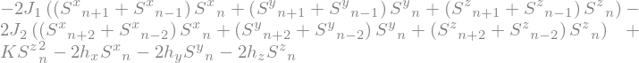
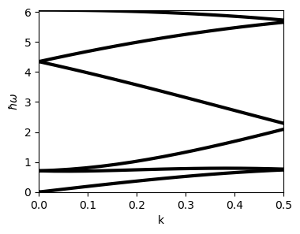
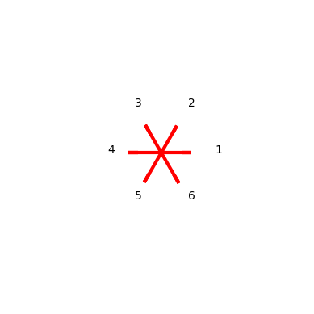
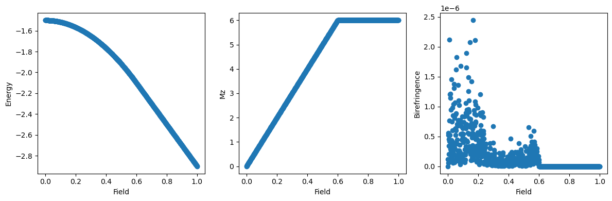
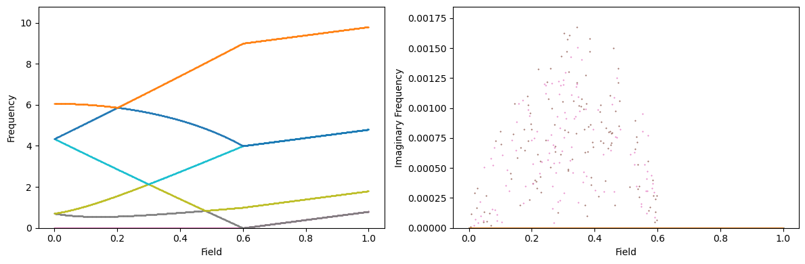

# pyLLspin

pyLLspin is a package to analytically handle linear spin-wave theory from the Landau-Lifshitz equation in 1 dimension.

The code works by first working through the formalism of linear-spin wave theory for an arbitrary Hamiltonian to obtain an effective magnetic field, plugging in a harmonic ansatz to the LL equaiton, and obtainin a matrix M to diagonlize, where the eigenvalues represent the spin-wave ferquencies as a function of wavevect, and the eigenstates the spin-wave modes.

From here, everything else, starting from diagonlization of the M matrix, can be handled numerically. In addition, tools are included for finding ground states (which are crucial for proper evaluation of M), and visualization of results.

An example calculation based on the J1-J2 model is found in exampleJ1J2.py, which we describe below:

We first define a Hamiltonian ```H_single``` as a sympy expression which represents the energy of the nth spin (ie, including coupling to all neighbors). For obtaining ground state codes, it is also necessary to define ```H_sum ```, which is the same Hamlitonian but such that it represents the nth term in $H = \sum_n H_n$. With these two analytical expressions we can then easily obtain 
```
# parameters and coupling constants
num_spins = 6
num_neighbors = 2 # specify number of neighbors for interaction
J1, J2, K, hx, hy, hz, a = sp.symbols('J_1, J_2, K, h_x, h_y, h_z, a_0')
h = sp.Matrix([hx, hy, hz]) # define coupling constant and material params
coupling_constants = [J1, J2, K, hx, hy, hz, a]

# energy of the nth spin
H_single = -2*J1*S(n).dot(S(n+1) + S(n-1)) + -2*J2*S(n).dot(S(n+2) + S(n-2)) - 2*S(n).dot(h) + K*Sz(n)**2
H_sum = -2*J1*S(n).dot(S(n+1)) + -2*J2*S(n).dot(S(n+2)) - 2*S(n).dot(h) + K*Sz(n)**2

# obtain analytical and numerical expressions for the LL matrix
M = get_analytical_ll_matrix_transv(H_single, num_spins, num_neighbors)
M_num = get_numerical_ll_matrix(M, coupling_constants, num_spins)
H_num = get_numerical_H(H_sum, coupling_constants, num_spins, num_neighbors)
H_math = get_mathematica_H(H_sum, num_spins, num_neighbors)
```

Print out the Hamiltonian to ensure that it looks as intended:



Next, we define the numerical coupling constants we want to use for the simulation:

```
####################################
### Numerical Coupling Constants ###
####################################

J1_n = 1
theta_num = 2*np.pi/num_spins
J2_n = -abs(J1_n/(4*np.cos(theta_num)))
K_n=0.1
hx_n=0
hy_n=0
hz_n=0
a_n=1

coupling_constants = [J1, J2, K, hx, hy, hz, a]
coupling_constants_n = [J1_n, J2_n, K_n, hx_n, hy_n, hz_n, a_n]
```

And then we can use ```compute_lswt```, which is a macro function that uses ```get_dispersion``` under the hood, to obtain the dispersion relation for a variety of wavevectors in ```k_vect```. Note that here we know that the ground state is a helix and so we put this in by hand, but in general one would need to compute the ground state.

```
#############################
### Dispersion at 0 field ###
#############################

k_vect = np.linspace(0,np.pi,100)
helix_state = np.array([[np.cos(i*np.pi/3),np.sin(i*np.pi/3),0] for i in range(num_spins)]) #
groundstate=helix_state
dispersion, eigenvects, groundstate = compute_lswt(H_single, H_math, coupling_constants, coupling_constants_n, k_vect, num_spins, num_neighbors, M_num, M, groundstate=groundstate)

# print energy of ground state, show ground state, and plot dispersion
print(H_num(*coupling_constants_n, *groundstate.flatten()))
plot_state(groundstate, elev=90)
fig, ax = plt.subplots(1, figsize=(4,3))
ax.set(xlabel='k', ylabel=r'$\hbar\omega$')
ax.set(xlim=(0,0.5), ylim=(0,np.max(np.real(dispersion))))
color, sm = helper.colormap_generator(0,len(dispersion), plt.get_cmap('jet'))
for i in range(len(dispersion)):
    ax.plot(k_vect, np.real(dispersion[i]), '-', lw=3, label=str(i), color='black')
plt.show()
```

This yields the following output showing the disperion relation as well as a visualization of the ground state using ```plot_state```:




Subsequent code then uses the ```find_ground_state``` function to evaluate the ground state for a range of different values of $h_z$, the out-of-plane field.

```
# compute ground state as a function of field:
hzs = np.linspace(0,1,1000)
coupling_constants_trial = [J1_n, J2_n, K_n, hx_n, hy_n, hz_n, a_n]
groundstates = []
groundstate_old = helix_state
groundstates.append(groundstate_old)
for ii in tqdm(range(1,len(hzs))):
    hzn = hzs[ii]
    coupling_constants_trial = [J1_n, J2_n, K_n, hx_n, hy_n, hzn, a_n]
    groundstate = find_ground_state_python(H_num, coupling_constants, coupling_constants_trial, num_spins, num_neighbors, x0=groundstate_old)
    groundstates.append(groundstate)
    groundstate_old = groundstate
```

As a check, we plot out the energy, $M_z$, and birefringence of the states as a function of field. We are enouraged that the calculation worked by the smoothness of the energy.

```
magx = np.array([np.sum(groundstates[i], axis=0)[0] for i in range(len(groundstates))])
magy = np.array([np.sum(groundstates[i], axis=0)[1] for i in range(len(groundstates))])
magz = np.array([np.sum(groundstates[i], axis=0)[2] for i in range(len(groundstates))])
bf = np.array([get_birefringence(groundstates[i])[0] for i in range(len(groundstates))])
es = []
for ii, hi in enumerate(hzs):
    coupling_constants_n = [J1_n, J2_n, K_n, hx_n, hy_n, hi, a_n]
    es.append(H_num(*coupling_constants_n, *groundstates[ii].flatten())/num_spins)

# plot ground state properties:
fig2 , ax2 = plt.subplots(1,3, figsize=(12,4))
ax2[0].plot(hzs, es, 'o')
ax2[1].plot(hzs, magz, 'o')
ax2[2].plot(hzs, bf, 'o')
ax2[0].set(xlabel='Field', ylabel='Energy')
ax2[1].set(xlabel='Field', ylabel='Mz')
ax2[2].set(xlabel='Field', ylabel='Birefringence')
fig2.tight_layout()
```



Lastly, with these ground states, we then compute the dispersion at each field and look at the k=0 component as a function of field:

```
# compute dispersion vs field:
k_vect = np.linspace(0,np.pi,100)
dispersions = 1j*np.zeros((2*num_spins, len(hzs), len(k_vect)))
eigenvectors = 1j*np.zeros((2*num_spins, len(hzs), len(k_vect), 2*num_spins))
coupling_constants_trial = [J1_n, J2_n, K_n, hx_n, hy_n, hz_n, a_n]
for ii in tqdm(range(len(hzs))):
    hzn = hzs[ii]
    coupling_constants_trial = [J1_n, J2_n, K_n, hx_n, hy_n, hzn, a_n]
    dispersion, eigenvects, g0 = compute_lswt(H_single, H_math, coupling_constants, coupling_constants_trial, k_vect, num_spins, num_neighbors, M_num, M, groundstate=groundstates[ii])
    dispersions[:,ii,:] = dispersion
    eigenvectors[:,ii,:,:] = eigenvects

# view field dependence of dispersion:
fig3, ax3 = plt.subplots(1,2, figsize=(12,4))
ax3[0].set(xlabel='Field', ylabel='Frequency')
ax3[1].set(xlabel='Field', ylabel='Imaginary Frequency')
kfreqs = dispersions[:,:,0]
for ii, mode in enumerate(kfreqs):
        ax3[0].plot(hzs, np.real(mode), 'o', ms=0.5, label=ii)
        ax3[1].plot(hzs, np.imag(mode), 'o', ms=0.5)
ax3[0].set(ylim=(0,None))
ax3[1].set(ylim=(0,None))
fig3.tight_layout()
```



Once again, here we look that the imaginary part of the energy is 0 - typically if the ground state is incorrect it will manifest as imaginary energy.